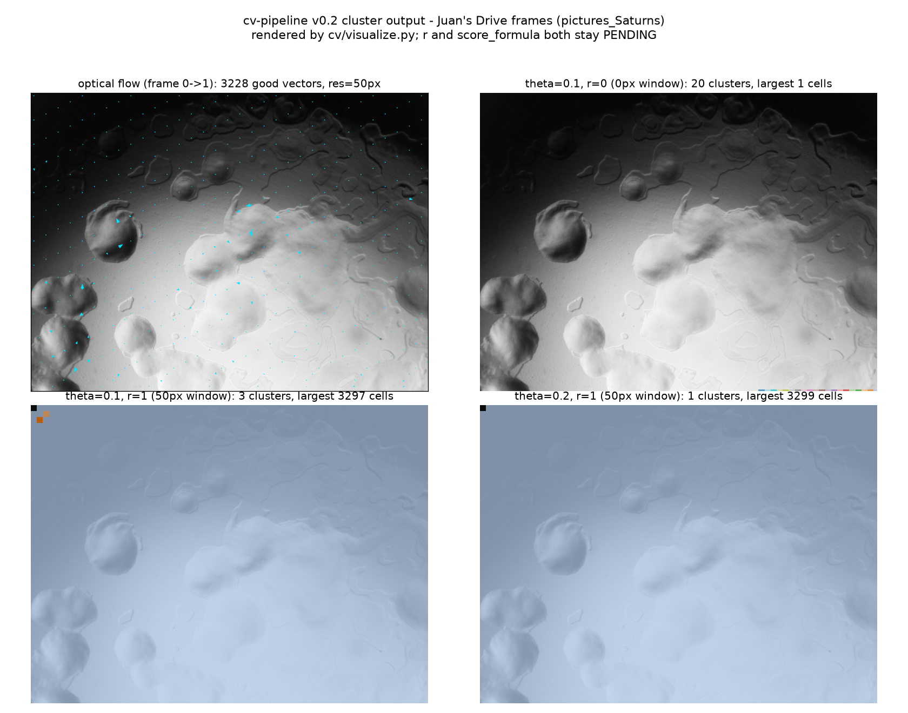

# cv-pipeline v0.2 - cluster output figure

Rendered by cv/visualize.py (workflow cv-visualize.yml) on Juan's public
Drive frames (pictures_Saturns). Same big_work2 code path as the theta
sweep - this figure renders the output, it does not pin anything.
score_formula and r both stay PENDING per cv/README.md.



```json
{
  "pipeline_version": "cv-pipeline v0.2",
  "generated_by": "cv/visualize.py (.github/workflows/cv-visualize.yml)",
  "source": "Juan Drive Paenibacillus_tracking (public), fetched in CI",
  "score_formula": "PENDING (score.py stub; no u16 produced)",
  "r_pin": "PENDING - cases rendered side by side, none chosen",
  "grid": [
    49,
    65
  ],
  "good_flow_vectors": 3228,
  "cases": {
    "theta0.1_r0": {
      "theta": 0.1,
      "r_cells": 0,
      "r_window_px": 0,
      "labels_found": 20,
      "labeled_cells": 20,
      "largest": 1,
      "grid": [
        50,
        66
      ]
    },
    "theta0.1_r1": {
      "theta": 0.1,
      "r_cells": 1,
      "r_window_px": 50,
      "labels_found": 3,
      "labeled_cells": 3299,
      "largest": 3297,
      "grid": [
        50,
        66
      ]
    },
    "theta0.2_r1": {
      "theta": 0.2,
      "r_cells": 1,
      "r_window_px": 50,
      "labels_found": 1,
      "labeled_cells": 3299,
      "largest": 3299,
      "grid": [
        50,
        66
      ]
    }
  }
}
```
